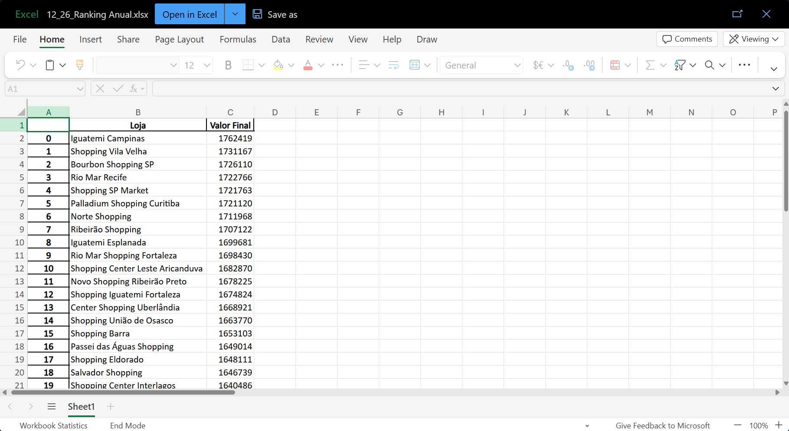
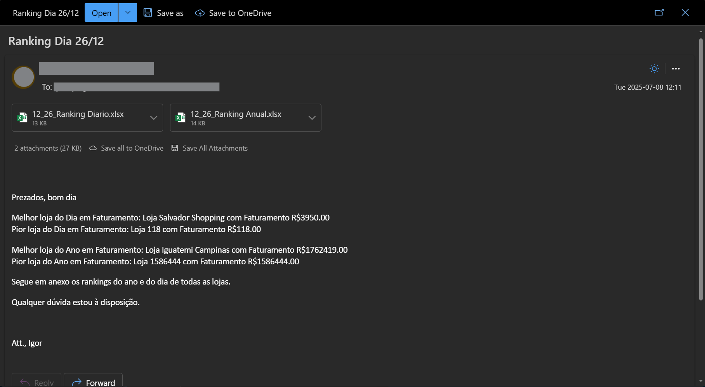

# Automação de Relatórios de Vendas por Loja

Este projeto automatiza a geração de relatórios personalizados por loja e o envio de e-mails para gerentes e diretoria com visualizações e análises de desempenho com base em metas pré-definidas. O objetivo é otimizar a comunicação dos resultados diários e anuais de vendas, mantendo histórico e promovendo decisões baseadas em dados.

## Visão Geral do Projeto

A rotina implementada neste projeto realiza as seguintes tarefas:

* Leitura dos arquivos de entrada (Emails.xlsx, Vendas.xlsx, Lojas.csv)
* Junção dos dados de vendas com os dados das lojas
* Geração de um relatório OnePage com indicadores de desempenho (por loja)
* Geração de planilhas individuais com os dados de vendas de cada loja
* Salvamento dos arquivos em pastas específicas, com nome da loja e data, para backup histórico
* Envio automatizado de e-mails:
  * Para cada gerente:
    * OnePage da sua loja incorporado no corpo do email
    * Arquivo completo com dados da respectiva loja em anexo
  * Para a diretoria:
    * Dois rankings em anexo: um do dia e outro anual
    * Análise no corpo do email destacando:
      * Melhor e pior loja do dia (baseado em faturamento)
      * Melhor e pior loja do ano (baseado em faturamento)

## Descrição dos Dados Utilizados

### Emails.xlsx
Contém nome, e-mail e loja de cada gerente, além dos e-mails da diretoria.

### Vendas.xlsx
Base de vendas contendo os registros de todas as lojas. Inclui colunas como:
* ``Data``
* ``ID Loja``
* ``Produto``
* ``Quantidade``
* ``Valor Unitário``

### Lojas.csv
Lista com os nomes das lojas e respectivos ID Loja.

## Explicação das Visualizações

Cada OnePage gerado para os gerentes contém os seguintes indicadores, tanto para o dia mais recente quanto para o ano atual:

* Faturamento Total
* Diversidade de Produtos Vendidos
* Ticket Médio por Venda

Cada métrica é comparada com metas definidas:

| Indicador | Meta Anual | Meta Diária |
|-----------|------------|-------------|
| Faturamento | R$1.650.000 | R$1.000 |
| Diversidade de Produtos | 120 | 4 |
| Ticket Médio | R$500 | R$500 |

* Valores acima da meta são marcados com um símbolo verde
* Valores abaixo da meta são marcados com um símbolo vermelho

## Métricas de Avaliação

As métricas utilizadas são baseadas em metas de negócio predefinidas. A avaliação do desempenho de cada loja é feita por:

* Comparação com metas diárias e anuais
* Ranking por faturamento (dia e ano)
* Identificação da melhor e pior loja em ambos os períodos

## Imagens de Exemplo

* Exemplo de OnePage

* Exemplo de Ranking

* Exemplo de E-mail Diretoria

## Tecnologias Utilizadas

* Python ``pandas``, ``pathlib``, ``datetime``
* Automação de e-mails com ``win32com.client`` (Outlook)
* Microsoft Excel (leitura e escrita com pandas)
* Estrutura modular em passos (células independentes por função)

## Melhorias Futuras

* Adicionar painel interativo com Dash ou Streamlit
* Incluir modelos de previsão de vendas (ML)
* Enviar relatórios também em PDF ou HTML com visualizações gráficas
* Tornar o envio compatível com servidores de e-mail genéricos (SMTP)
* Agendamento automático com cron ou tarefas do Windows